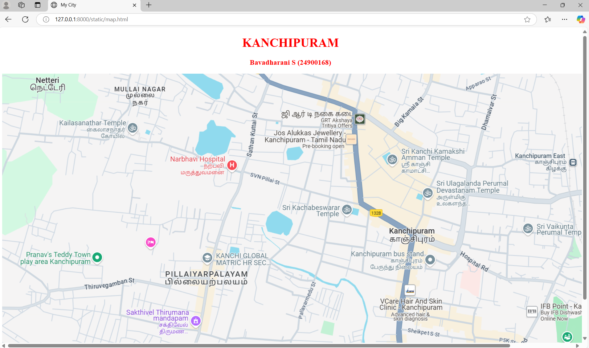
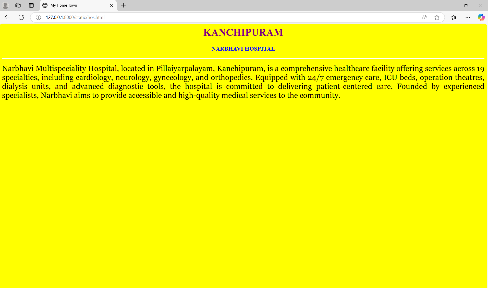
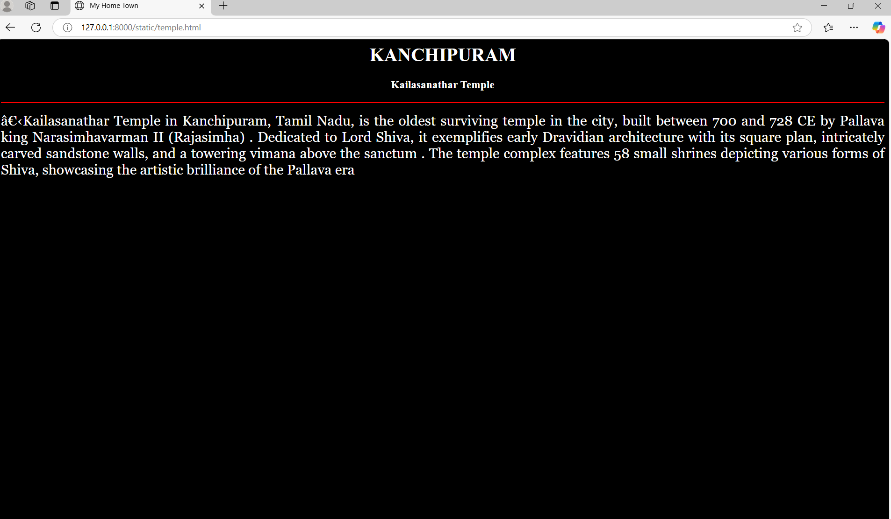
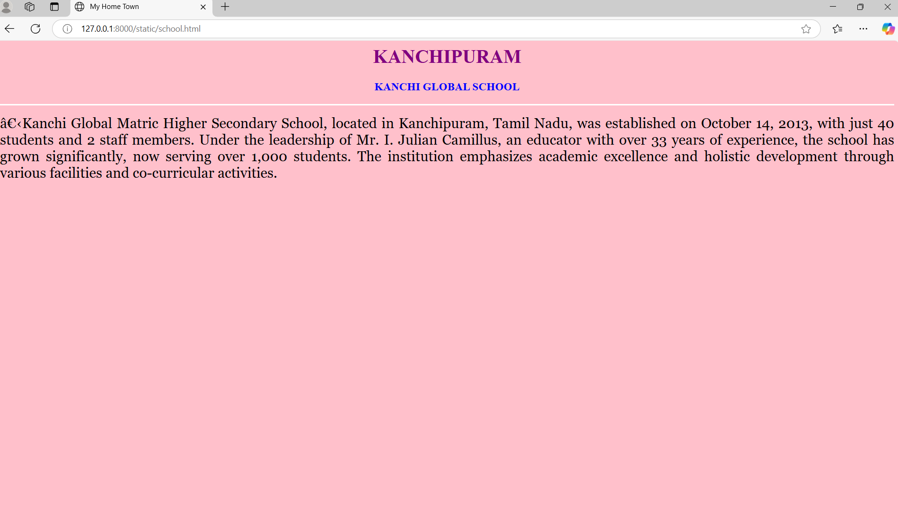
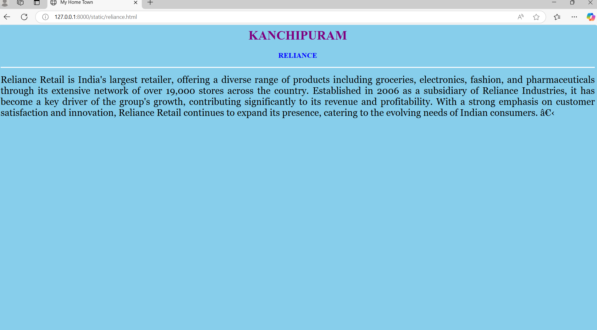
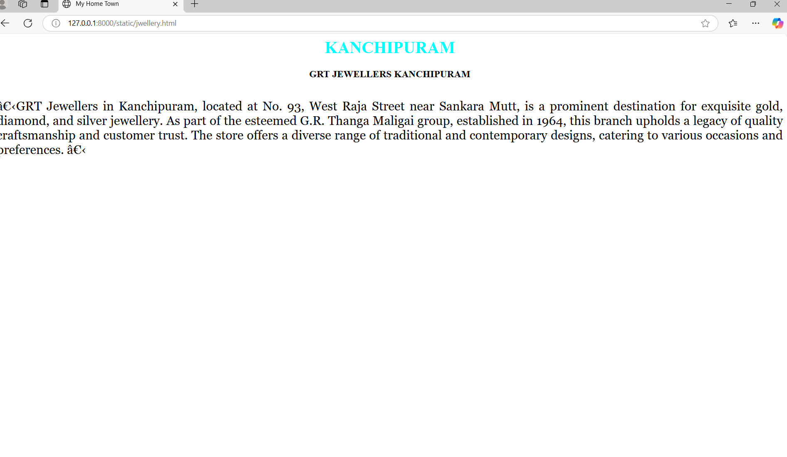

# Ex04 Places Around Me
## Date:  28/04/2025

## AIM
To develop a website to display details about the places around my house.

## DESIGN STEPS

### STEP 1
Create a Django admin interface.

### STEP 2
Download your city map from Google.

### STEP 3
Using ```<map>``` tag name the map.

### STEP 4
Create clickable regions in the image using ```<area>``` tag.

### STEP 5
Write HTML programs for all the regions identified.

### STEP 6
Execute the programs and publish them.

## CODE

```
map.html


<!DOCTYPE html>
<html lang="en">
<head>
    <meta charset="UTF-8">
    <meta name="viewport" content="width=device-width, initial-scale=1.0">
    <title>My City</title>
</head>
<body>
 <center>
    <h1 style="color:red">KANCHIPURAM</h1>
    <h3 style="color:red">Bavadharani S (24900168)</h3>
 </center>   


<map name="image-map">
    <area target="" alt="Temple" title="Temple" href="temple.html" coords="247,135,97" shape="circle">
    <area target="" alt="GRT" title="GRT" href="jwellery.html" coords="825,165,148" shape="circle">
    <area target="" alt="Narbhavi" title="Narbhavi" href="hos.html" coords="521,238,94" shape="circle">
    <area target="" alt="Kanchi Global" title="Kanchi Global" href="school.html" coords="603,483,94" shape="circle">
    <area target="" alt="Reliance" title="Reliance" href="reliance.html" coords="1093,717,84" shape="circle">
</map>


</center>
</body>
</html>

reliance.html

<html>
<head>
<title>My Home Town</title>
</head>
<body bgcolor="skyblue">
<h1 align="center">
<font color="purple"><b>KANCHIPURAM</b></font>
</h1>
<h3 align="center">
<font color="blue"><b>RELIANCE</b></font>
</h3>
<hr size="3" color="white">
<p align="justify">
<font face="Georgia" size="5">
Reliance Retail is India's largest retailer, offering a diverse range of products including groceries, electronics, fashion, and pharmaceuticals through its extensive network of over 19,000 stores across the country.
Established in 2006 as a subsidiary of Reliance Industries, it has become a key driver of the group's growth, contributing significantly to its revenue and profitability. 
With a strong emphasis on customer satisfaction and innovation, Reliance Retail continues to expand its presence, catering to the evolving needs of Indian consumers. ​
</p>
</body>
</html>

school.html

<html>
<head>
<title>My Home Town</title>
</head>
<body bgcolor="pink">
<h1 align="center">
<font color="purple"><b>KANCHIPURAM</b></font>
</h1>
<h3 align="center">
<font color="blue"><b>KANCHI GLOBAL SCHOOL</b></font>
</h3>
<hr size="3" color="white">
<p align="justify">
<font face="Georgia" size="5">
    
    ​Kanchi Global Matric Higher Secondary School, located in Kanchipuram, Tamil Nadu, was established on October 14, 2013, with just 40 students and 2 staff members.
     Under the leadership of Mr. I. Julian Camillus, an educator with over 33 years of experience, the school has grown significantly, now serving over 1,000 students.
     The institution emphasizes academic excellence and holistic development through various facilities and co-curricular activities. 

   </p>
</body>
</html>

hos.html

<html>
<head>
<title>My Home Town</title>
</head>
<body bgcolor="yellow">
<h1 align="center">
<font color="purple"><b>KANCHIPURAM</b></font>
</h1>
<h3 align="center">
<font color="blue"><b>NARBHAVI HOSPITAL</b></font>
</h3>
<hr size="3" color="white">
<p align="justify">
<font face="Georgia" size="5">
    
    Narbhavi Multispeciality Hospital, located in Pillaiyarpalayam, Kanchipuram, is a comprehensive healthcare facility offering services across 19 specialties, including cardiology, neurology, gynecology, and orthopedics.
    Equipped with 24/7 emergency care, ICU beds, operation theatres, dialysis units, and advanced diagnostic tools, the hospital is committed to delivering patient-centered care.
    Founded by experienced specialists, Narbhavi aims to provide accessible and high-quality medical services to the community.

   </p>
</body>
</html>

jwellery.html

<html>
<head>
<title>My Home Town</title>
</head>
<body bgcolor="white">
<h1 align="center">
<font color="cyan"><b>KANCHIPURAM</b></font>
</h1>
<h3 align="center">
<font color="black"><b>GRT JEWELLERS KANCHIPURAM</b></font>
</h3>
<hr size="3" color="white">
<p align="justify">
<font face="Georgia" size="5">
    
    ​GRT Jewellers in Kanchipuram, located at No. 93, West Raja Street near Sankara Mutt, is a prominent destination for exquisite gold, diamond, and silver jewellery.
     As part of the esteemed G.R. Thanga Maligai group, established in 1964, this branch upholds a legacy of quality craftsmanship and customer trust.
     The store offers a diverse range of traditional and contemporary designs, catering to various occasions and preferences. ​    
</p>
</body>
</html>

temple.html

<html>
<head>
<title>My Home Town</title>
</head>
<body bgcolor="black">
<h1 align="center">
<font color="white"><b>KANCHIPURAM</b></font>
</h1>
<h3 align="center">
<font color="white"><b>Kailasanathar Temple</b></font>
</h3>
<hr size="3" color="red">
<p align="justify">
<font face="Georgia" size="5 " font color="white">
    ​Kailasanathar Temple in Kanchipuram, Tamil Nadu, is the oldest surviving temple in the city, built between 700 and 728 CE by Pallava king Narasimhavarman II (Rajasimha) .
     Dedicated to Lord Shiva, it exemplifies early Dravidian architecture with its square plan, intricately carved sandstone walls, and a towering vimana above the sanctum .
     The temple complex features 58 small shrines depicting various forms of Shiva, showcasing the artistic brilliance of the Pallava era 
</p>
</body>
</html>

```

## OUTPUT














## RESULT
The program for implementing image maps using HTML is executed successfully.
